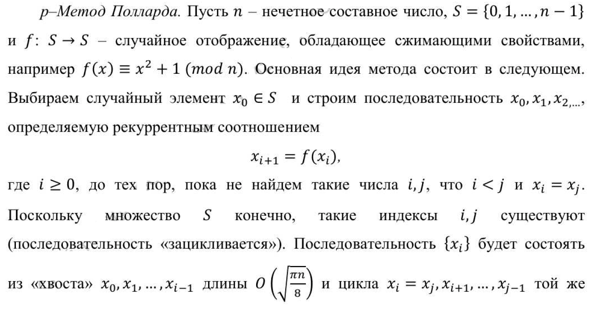
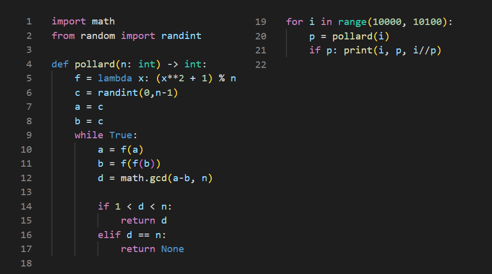

---
## Front matter
lang: ru-RU
title: "Лабораторная работа 6"
subtitle: "Разложение чисел на множители" 
author: "Баранов Иван"
institute: RUDN University, Moscow, Russian Federation
date: 2022 Москва

## Formatting
mainfont: PT Serif
romanfont: PT Serif
sansfont: PT Serif
monofont: PT Serif
toc: false
slide_level: 2
theme: metropolis
header-includes: 
 - \metroset{progressbar=frametitle,sectionpage=progressbar,numbering=fraction}
 - '\makeatletter'
 - '\beamer@ignorenonframefalse'
 - '\makeatother'
aspectratio: 169
section-titles: true
---

# Цель работы 

## Цель работы

- Ознакомиться с задачей разложения простого числа на множители

- Рассмотреть каноническое представление числа 

- Реализовать метод нахождения нетривиальных сомножителей

# Описание задачи

## Каноническое разложение  

Задача разложения на множители - одна из первых задач, использованных для построения криптосистем с открытым ключом.

Задача разложения составного числа на множители формулируется следующим образом: 

для данного положительного целого числа $n$ найти его каноническое разложение $n = p_{1}^{a_1} p_{2}^{a_2} ... p_{s}^{a_s}$, где $p_i$ - попарно различные простые числа, $a_i >= 1$

## Задача нахождения сомножителей

На практике не обязательно находить каноническое разложение числа $n$.

Достаточно найти его разложение на два нетривиальных сомножителя: $n = pq, 1 <= p <= q < n$. 

Далее будем понимать задачу разложения именно в этом смысле. Для её решения воспользуемся p-Методом Полларда (рис. -@fig:001) и реализуем его посредством Python (рис. -@fig:002)

# Описание алгоритма 

## Описание алгоритма

{ #fig:001 width=90% }

# Реализация алгоритма 

## Реализация алгоритма 

{ #fig:002 width=80% }

# Выводы

## Выводы

- Ознакомились с задачей разложения простого числа на множители

- Рассмотрели каноническое представление числа 

- Реализовали метод нахождения нетривиальных сомножителей

## {.standout}

