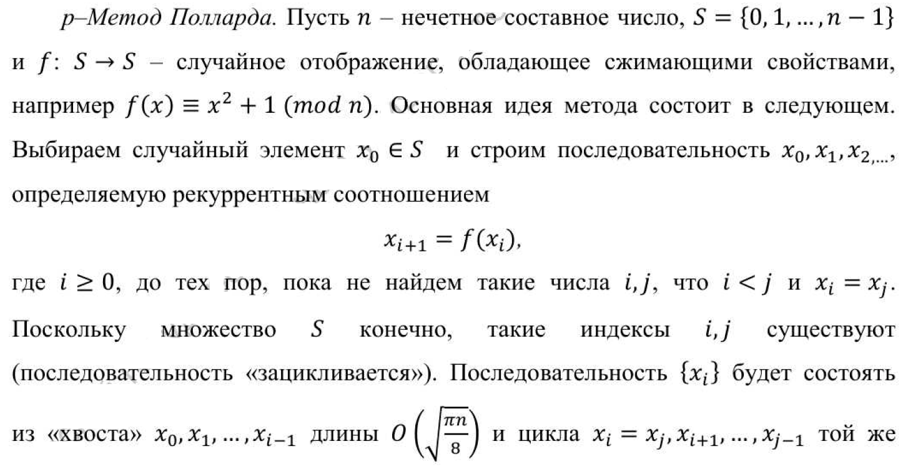
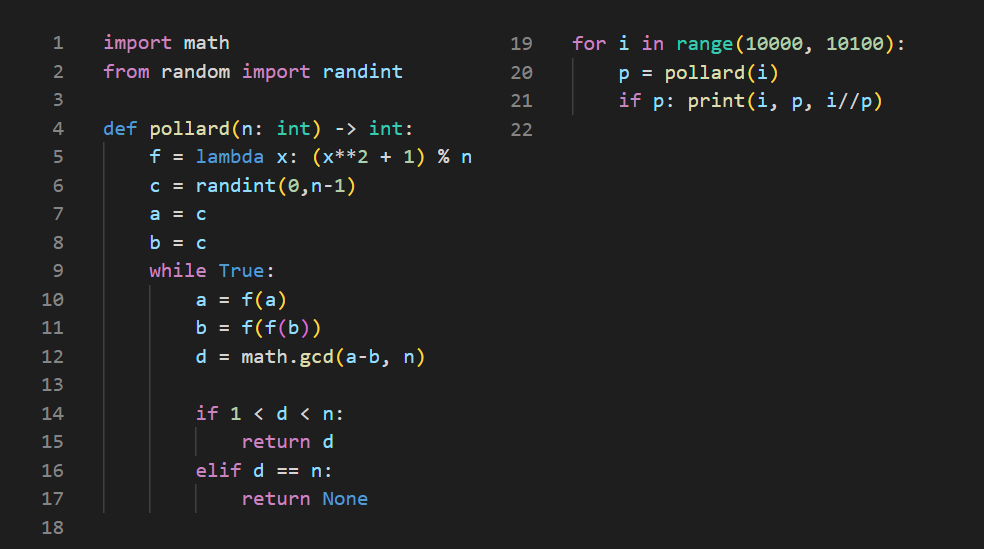

---
# Front matter
lang: ru-RU
title: "Лабораторная работа 6"
subtitle: "Разложение чисел на множители" 
author: "Баранов Иван"

# Formatting
toc-title: "Содержание"
toc: true # Table of contents
toc_depth: 2
lof: true # List of figures
lot: false # List of tables
fontsize: 12pt
linestretch: 1.5
papersize: a4paper
documentclass: scrreprt
polyglossia-lang: russian
polyglossia-otherlangs: english
mainfont: PT Serif
romanfont: PT Serif
sansfont: PT Serif
monofont: PT Serif
mainfontoptions: Ligatures=TeX
romanfontoptions: Ligatures=TeX
sansfontoptions: Ligatures=TeX,Scale=MatchLowercase
monofontoptions: Scale=MatchLowercase
indent: true
pdf-engine: lualatex
header-includes:
  - \linepenalty=10 # the penalty added to the badness of each line within a paragraph (no associated penalty node) Increasing the value makes tex try to have fewer lines in the paragraph.
  - \interlinepenalty=0 # value of the penalty (node) added after each line of a paragraph.
  - \hyphenpenalty=50 # the penalty for line breaking at an automatically inserted hyphen
  - \exhyphenpenalty=50 # the penalty for line breaking at an explicit hyphen
  - \binoppenalty=700 # the penalty for breaking a line at a binary operator
  - \relpenalty=500 # the penalty for breaking a line at a relation
  - \clubpenalty=150 # extra penalty for breaking after first line of a paragraph
  - \widowpenalty=150 # extra penalty for breaking before last line of a paragraph
  - \displaywidowpenalty=50 # extra penalty for breaking before last line before a display math
  - \brokenpenalty=100 # extra penalty for page breaking after a hyphenated line
  - \predisplaypenalty=10000 # penalty for breaking before a display
  - \postdisplaypenalty=0 # penalty for breaking after a display
  - \floatingpenalty = 20000 # penalty for splitting an insertion (can only be split footnote in standard LaTeX)
  - \raggedbottom # or \flushbottom
  - \usepackage{float} # keep figures where there are in the text
  - \floatplacement{figure}{H} # keep figures where there are in the text
---

# Цель работы 

- Ознакомиться с задачей разложения простого числа на множители

- Рассмотреть каноническое представление числа 

- Реализовать метод нахождения нетривиальных сомножителей


# Описание задачи

## Каноническое разложение  

Задача разложения на множители - одна из первых задач, использованных для построения криптосистем с открытым ключом.

Задача разложения составного числа на множители формулируется следующим образом: 

для данного положительного целого числа $n$ найти его каноническое разложение $n = p_{1}^{a_1} p_{2}^{a_2} ... p_{s}^{a_s}$, где $p_i$ - попарно различные простые числа, $a_i >= 1$

## Задача нахождения сомножителей

На практике не обязательно находить каноническое разложение числа $n$.

Достаточно найти его разложение на два нетривиальных сомножителя: $n = pq, 1 <= p <= q < n$. 

Далее будем понимать задачу разложения именно в этом смысле. Для её решения воспользуемся p-Методом Полларда (рис. -@fig:001) и реализуем его посредством Python (рис. -@fig:002)

# Описание алгоритма 

{ #fig:001 width=90% }

# Реализация алгоритма 

{ #fig:002 width=80% }

# Программный код

```
import math 
from random import randint

def pollard(n: int) -> int:
    f = lambda x: (x**2 + 1) % n
    c = randint(0,n-1)
    a = c
    b = c
    while True:
        a = f(a)
        b = f(f(b))
        d = math.gcd(a-b, n)

        if 1 < d < n:
            return d
        elif d == n:
            return None

for i in range(10000, 10100):
    p = pollard(i)
    if p: print(i, p, i//p)
```

# Выводы

- Ознакомились с задачей разложения простого числа на множители

- Рассмотрели каноническое представление числа 

- Реализовали метод нахождения нетривиальных сомножителей
